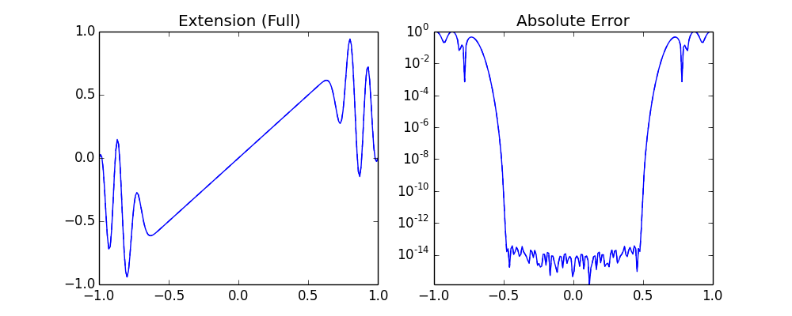
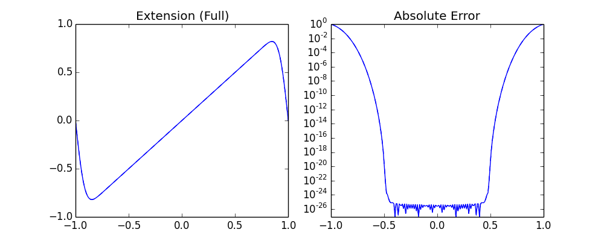
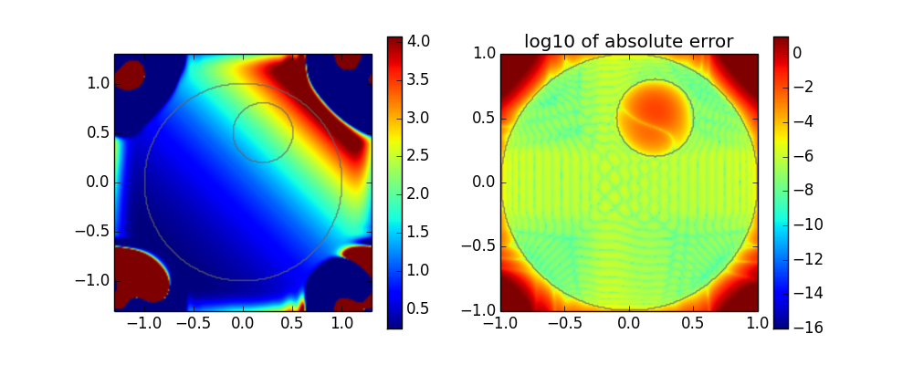
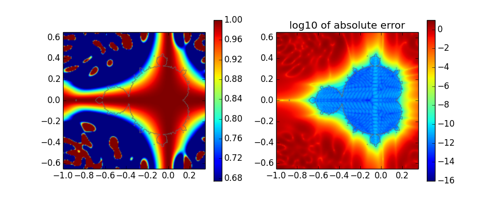

[](https://travis-ci.org/daanhb/FrameFun.jl)
[](https://coveralls.io/github/daanhb/FrameFun.jl)

FrameFun
========

Exploring practical possibilities of approximating functions with frames rather than with a basis. The package is heavily inspired by the Chebfun project and the Julia package ApproxFun.


```julia
using BasisFunctions, Plots, DomainSets, FrameFun
gr();
```

# Frame Approximations in 1D

After choosing a suitable Basis and Domain, any function can be approximated in the resulting frame:


```julia
B = Fourier(61, -1, 1)
D = -0.5..0.5
f = x->x
F = Fun(f,B,D)

P = plot(F,plot_ext=true, layout = 2)
plot!(F,f,plot_ext=true, subplot=2)
Plots.savefig(P,"images/lowprecision.png")
```



The bases support any AbstractFloat subtype, so high precision approximations are straightforward:


```julia
B = Fourier(61, BigFloat(-1), BigFloat(1))
F = Fun(f,B,D)

P = plot(F,plot_ext=true,layout=2)
plot!(F,f,plot_ext=true,subplot=2)
Plots.savefig(P,"images/highprecision.png")
```




# Frame Approximations in 2D

In higher dimensions, a basis can be any tensorproduct of (scaled) lower dimensional bases:


```julia
using StaticArrays
C = disk(1.0)\disk(0.3,SVector(0.2, 0.5))
B = Fourier(31,-1.3,1.3) ⊗ Fourier(31,-1.3,1.3)
f = (x,y)->exp(x+y)
F = Fun(f,B,C)

P = heatmap(F,plot_ext=true,layout=2,aspect_ratio=1)
plot!(F,f,plot_ext=true,subplot=2,aspect_ratio=1)
Plots.savefig(P,"images/deathstar.png")
```



Even fractal domains are not a problem:


```julia
B = Fourier(31,-1.0,0.35) ⊗ Fourier(31,-0.65,0.65)
f = (x,y)->cos(10*x*y)
F = Fun(f, B, mandelbrot())

P = heatmap(F,plot_ext=true,layout=2,aspect_ratio=1)
plot!(F,f,plot_ext=true,aspect_ratio=1,subplot=2)
Plots.savefig(P,"images/mandelbrot")
```

    GKS: Rectangle definition is invalid in routine SET_WINDOW
    GKS: Rectangle definition is invalid in routine CELLARRAY
    origin outside current window



